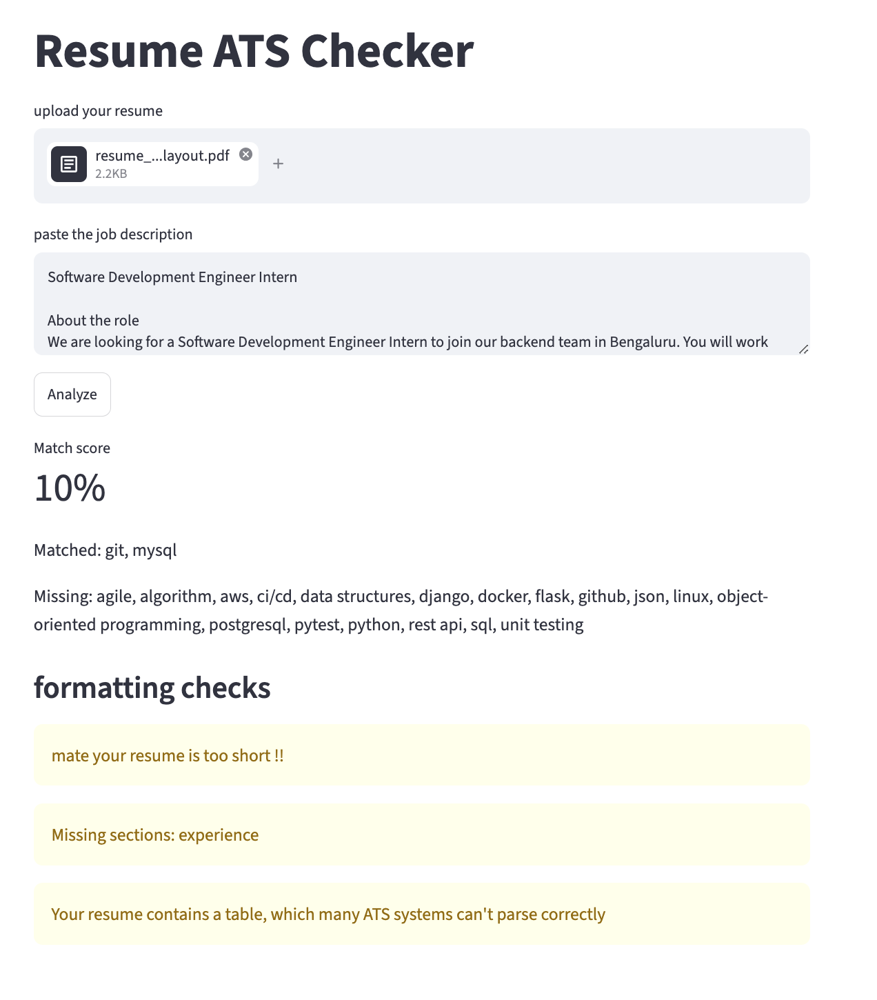
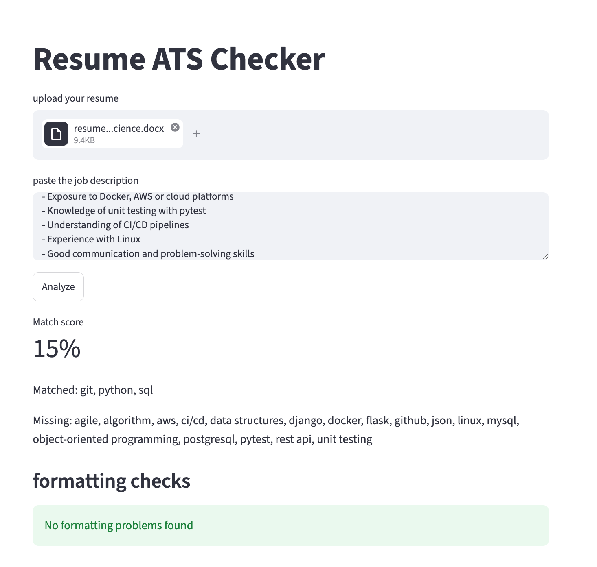

# Resume Parser + ATS Score Checker

A Streamlit app that compares a resume against a job description and shows how well they match. It also flags formatting problems that applicant tracking systems (ATS) often fail to parse.

**Live demo:** https://resume-ats-checker-nashath.streamlit.app




## What it does

Upload a resume (PDF or DOCX), paste a job description, and click Analyze. You get:

- **Match score:** the percentage of the job description's skills that appear in the resume
- **Matched and missing skills:** so you know what to add
- **Formatting checks:**
  - resume is too short
  - missing standard sections (experience, education, skills)
  - tables (which many ATS cannot read correctly)

## How it works

- `extract.py` pulls text from PDFs (pdfplumber) and DOCX files (python-docx)
- `match.py` finds skills with regex word-boundary matching against a skills list
- `checks.py` runs the formatting checks
- `app.py` is the Streamlit interface

## Run it locally

```bash
git clone https://github.com/mohamadnashath/resume-ats-checker.git
cd resume-ats-checker
python -m venv venv
source venv/bin/activate
pip install -r requirements.txt
streamlit run app.py
```

## Limitations

- The skills list is hand-written and focused on tech roles, so other fields will score poorly.
- Skills are matched by exact name. A resume that says "OOP" will not match a job description that says "object-oriented programming".
- Resumes laid out in tables can be extracted in a jumbled order. The app warns about this, but the match score may still be low.
- Scanned (image-only) PDFs are not supported.

## Built with

Python, Streamlit, pdfplumber, python-docx, scikit-learn
